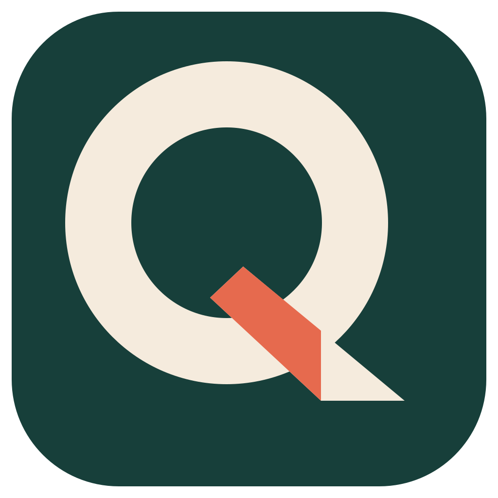
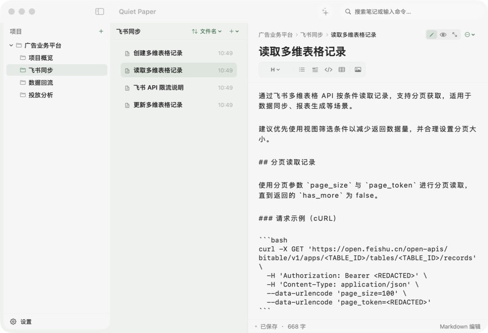
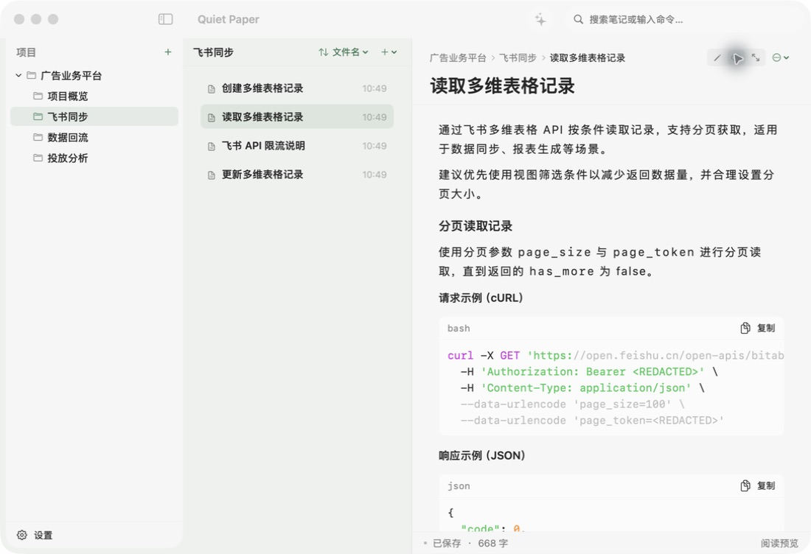
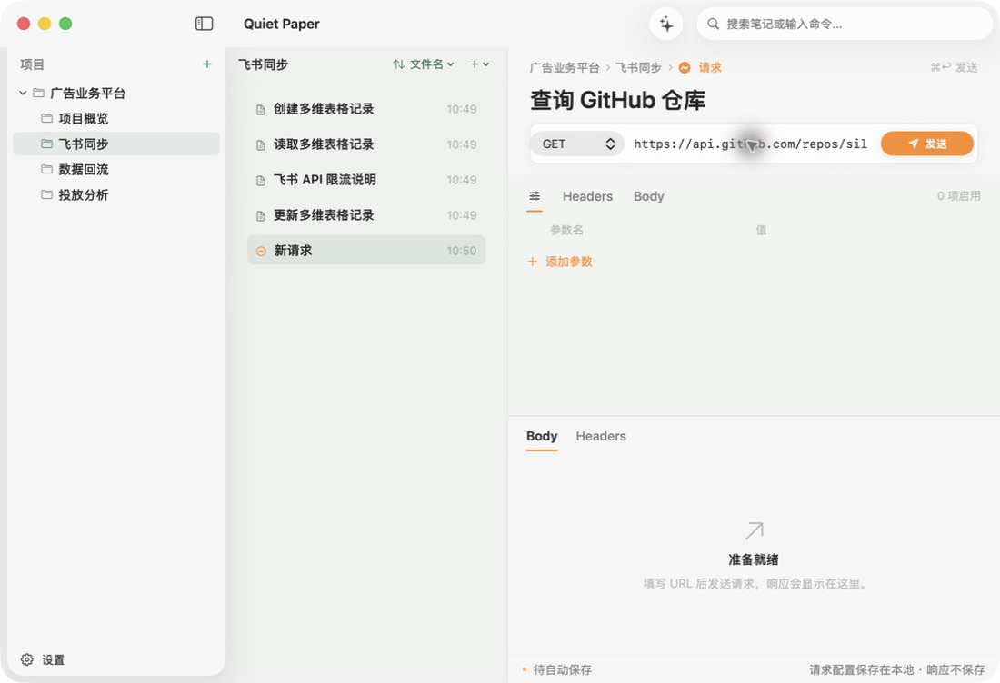
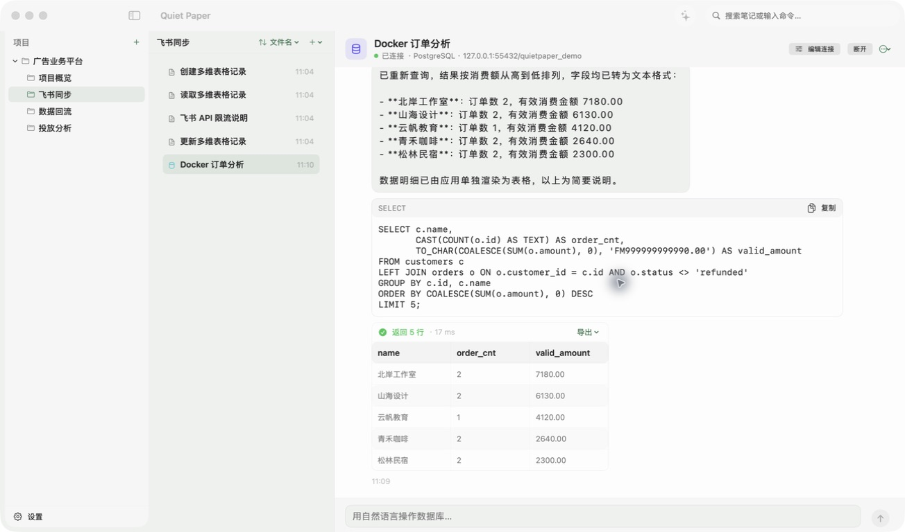

<div align="center">
  
  <h1>Quiet Paper</h1>
  <p>一个把笔记、接口请求和数据库工作台放在本机的 macOS 应用。</p>
</div>



Quiet Paper 适合按“项目 / 模块 / 文件”整理长期资料。它不是云笔记服务，没有账号体系，日常编辑、搜索、附件和备份都直接落在自己的 Mac 上。

## 能做什么

- 用 Markdown 写笔记，在编辑和阅读预览之间切换。
- 按项目、模块和文件组织内容，支持排序、快速跳转和专注模式。
- 搜索标题、正文和路径；普通笔记可使用系统 NLP 能力建立本地向量索引。
- 保存并运行 HTTP 请求，编辑 Query、Headers 和 JSON / 文本 Body。
- 管理 MySQL、PostgreSQL、Redis 和 SQLite 连接，用自然语言生成 SQL，并在应用内查看结构化结果。
- 把单篇笔记导出为 Markdown，或按项目 / 模块合并导出、打包为 ZIP。
- 备份完整数据库和附件，也可以在设置中迁移存储目录。

## 界面

### Markdown 编辑与预览

编辑器提供标题、列表、引用、代码块、表格和图片工具。阅读模式会渲染代码块，并保留一键复制按钮。



### HTTP 请求

请求文件和普通笔记放在同一套项目目录中。只有点击“发送”后，应用才会访问填写的 HTTP 或 HTTPS 地址；响应默认只保留在当前会话。



### AI 数据库助手

数据库连接和笔记一样保存在项目目录中。连接成功后，可以直接描述想查什么；Quiet Paper 会展示生成的 SQL、执行耗时和表格结果。写入或修改类命令会在真正执行前再次确认。



仓库里附了一套不含真实业务数据的 PostgreSQL 演示环境。Docker 启动后会创建虚构的客户和订单数据：

```bash
docker compose -f docker-compose.demo.yml up -d
```

在应用中新建 PostgreSQL 连接，填写 `127.0.0.1:55432`，用户名和数据库名均为 `quietpaper_demo`，演示密码是 `quietpaper_demo_only`。随后可以直接问：

> 统计每个客户的订单数和有效消费金额，排除退款，按消费额从高到低取前 5 名。

这套账号只服务于绑定在本机回环地址的演示容器，不要把同样的密码用在其他环境。停止演示环境可运行：

```bash
docker compose -f docker-compose.demo.yml down
```

## 运行

需要 macOS 13 或更高版本、Swift 6，以及系统自带的 SQLite 3（包含 FTS5）。

```bash
git clone https://github.com/silly-agent/QuietPaper.git
cd QuietPaper
swift run QuietPaper
```

第一次启动时，应用会自动创建目录、SQLite 数据库和一组脱敏示例笔记，不需要手工准备数据库。默认位置是：

```text
~/Library/Application Support/QuietPaper/
```

构建可直接打开的应用包：

```bash
./scripts/build-app.sh
open dist/QuietPaper.app
```

Intel Mac 可以使用：

```bash
./scripts/build-app-intel.sh
open dist/QuietPaper-Intel.app
```

构建脚本会自动递增补丁版本号。

## 测试

```bash
./scripts/run-tests.sh
```

测试使用 `WorkspaceDatabase(inMemory: true)`，不会读取、清空或修改正式数据库。

## 数据边界

- 笔记数据库、WAL 文件、附件、备份、构建目录和本地配置都已加入 `.gitignore`。
- 搜索、Markdown 处理、导出和向量化在本机完成。
- HTTP 请求和数据库连接只在用户主动操作时访问目标地址。
- DeepSeek 是可选功能。配置 API Key 后，笔记问答会发送提问及相关笔记片段；数据库助手只发送问题和经过裁剪的表结构，不发送连接密码或完整连接串。
- 请求文件和数据库连接可能包含凭证。公开导出文件或提交代码前，请自行检查其中的敏感信息。

## 目录

```text
Sources/QuietPaper/App             应用入口与状态
Sources/QuietPaper/Domain          模型和协议
Sources/QuietPaper/Data            SQLite 持久化与搜索
Sources/QuietPaper/Infrastructure  Markdown、附件、HTTP、数据库与 AI
Sources/QuietPaper/Features        SwiftUI 界面
Tests                              本地检查程序
scripts                            测试与打包脚本
```

## 参与开发

提交改动前请先运行 `./scripts/run-tests.sh`。涉及数据库的测试必须使用内存数据库，不要让开发或测试脚本指向用户的正式数据目录。

## License

[MIT](LICENSE)
