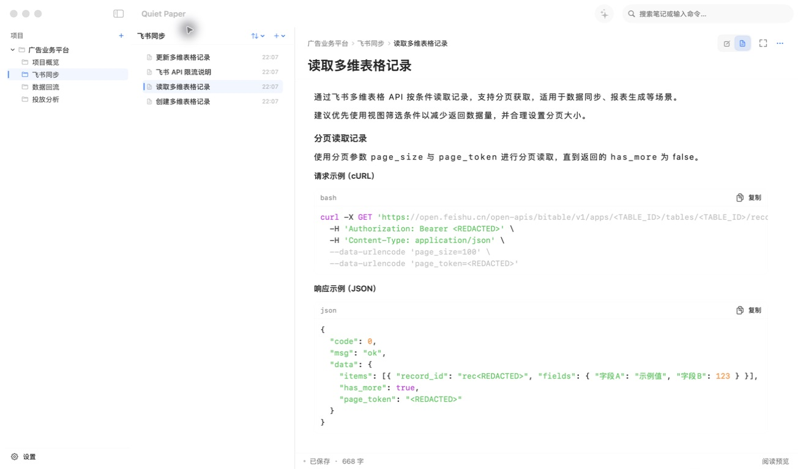
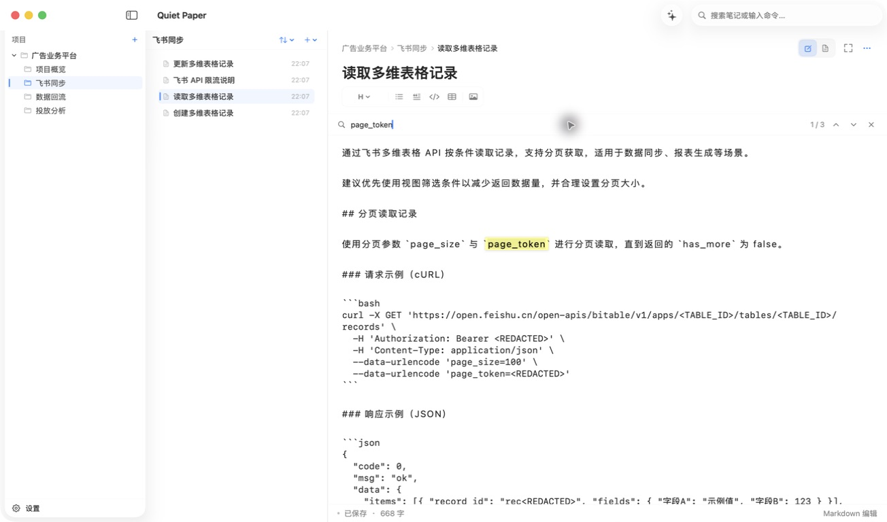
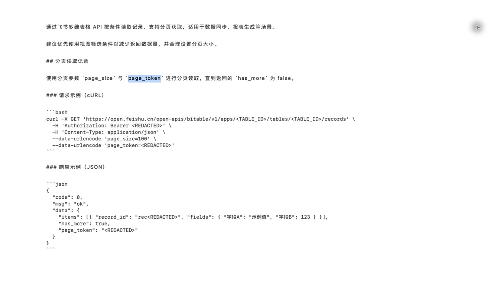
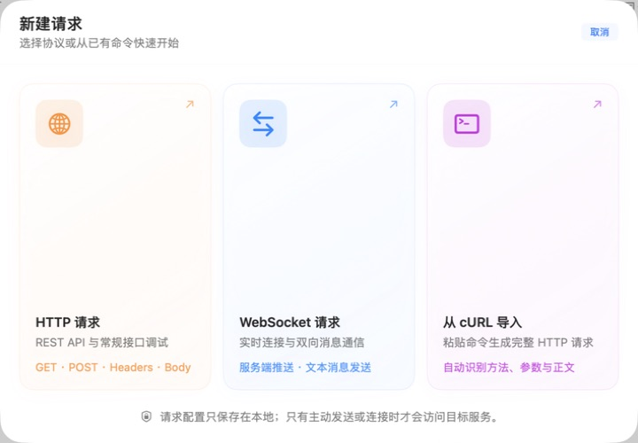
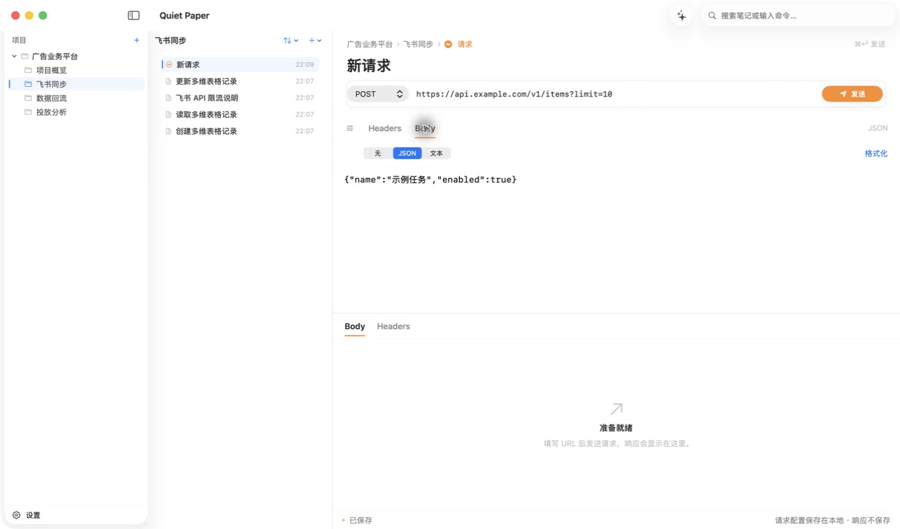
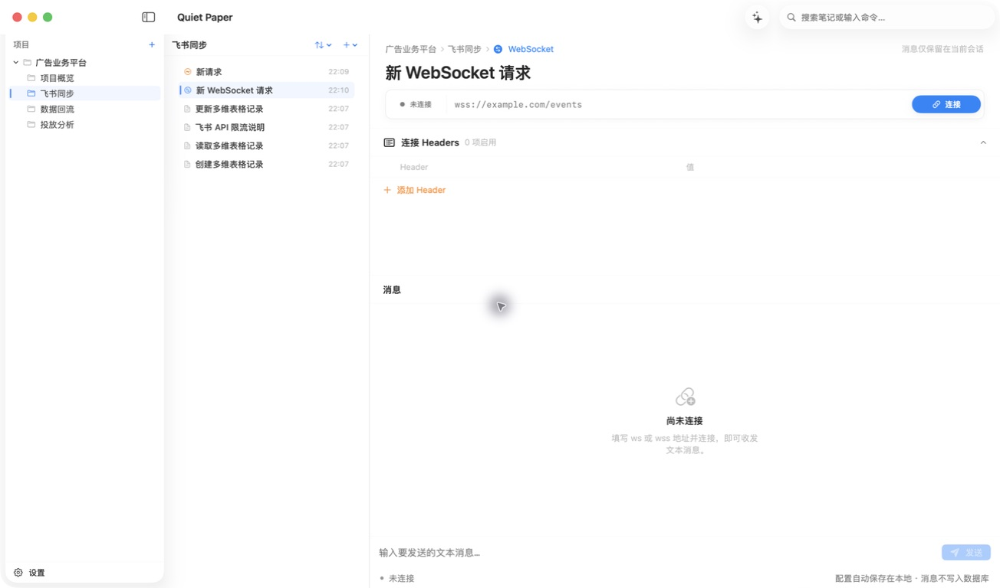
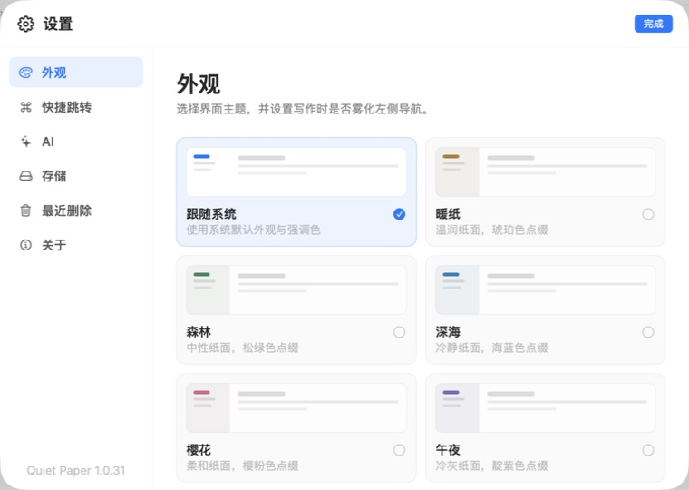
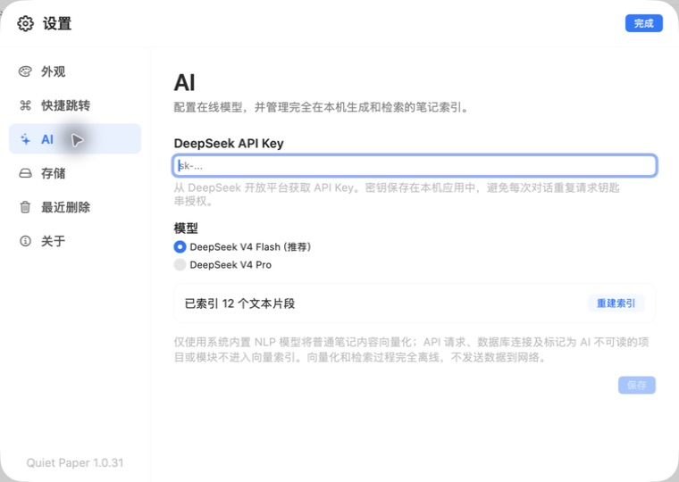
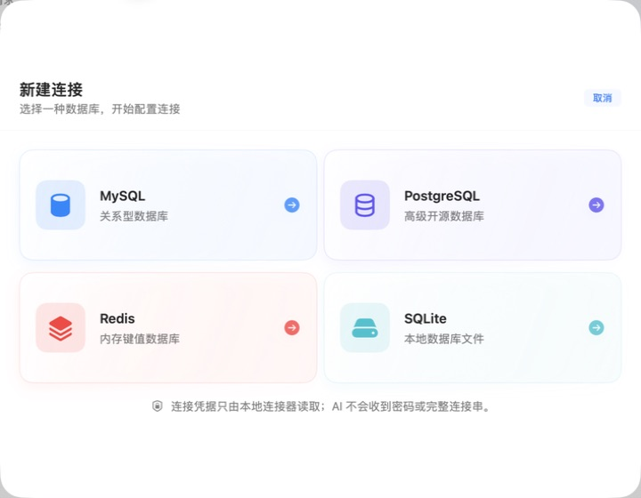

# Quiet Paper 1.0.31 使用说明

这次更新把写笔记、查内容、调接口和管理数据库几条常用路径一起打磨了一遍。界面更轻，创建请求更直观，也补上了 WebSocket、cURL 导入和更明确的本地隐私保护。

## 下载与打开

Release 提供两份下载包：名称带 `Apple-Silicon` 的版本适用于 M1、M2、M3、M4 及后续芯片；名称带 `Intel` 的版本适用于较早的 Intel Mac。下载对应的 ZIP 后解压，把应用拖进“应用程序”即可。

应用采用本地签名，没有经过 Apple 公证。如果 macOS 第一次拦截，请在 Finder 中右键应用并选择“打开”。笔记、附件、搜索索引和请求配置仍保存在自己的 Mac 上。

## 笔记阅读与编辑

项目、模块和文件仍然放在左侧，正文留出更宽的阅读空间。Markdown 预览会直接排好标题、代码块和 JSON，代码块右上角可以一键复制。

在当前笔记中按 `Command-F` 就能查找。命中内容会高亮，按 Enter 看下一处，按 Shift-Enter 看上一处，走到末尾后会自动回到开头。

需要沉浸写作时，可以打开专注模式，只保留正文。普通编辑状态下，标题或正文获得焦点后，左侧导航也会轻柔雾化；把鼠标移回左侧就会立即恢复清晰。这个效果可以在“设置 → 外观”中关闭。

文件列表现在更紧凑，选中项更容易辨认。按住 Shift 可以连续选择多篇笔记，再从右键菜单一次移到“最近删除”；它们仍可恢复，不会直接永久清除。

## HTTP、cURL 与 WebSocket

“新建请求”现在会先让你选择要做什么：普通 HTTP 请求、WebSocket，或直接粘贴一段 cURL。所有配置默认只保存在本地，只有主动点击“发送”或“连接”后才会访问填写的地址。

从 cURL 导入时，Quiet Paper 会识别请求方法、URL、Headers 和 Body。生成后仍然可以逐项修改；响应只留在当前会话，不会自动写进笔记数据库。

WebSocket 工作台可以保存连接地址与 Headers，连接后实时查看服务端消息并发送文本。断开或关闭文件后连接会结束，聊天记录不会写入数据库。

## 外观与 AI

内置六种外观：跟随系统、暖纸、森林、深海、樱花和午夜。设置页左下角会显示当前版本，便于确认是否已更新到 `1.0.31`。

普通笔记可以在本机建立向量索引，用于搜索和笔记问答。向量化与检索完全离线；HTTP 请求、数据库连接，以及标记为“AI 不可读”的项目或模块不会进入索引。

如果配置 DeepSeek，只有主动发起问答时才会发送问题和相关笔记片段。项目或模块的右键菜单可以随时切换“AI 不可读”，普通编辑、搜索和导出不受影响。

## 数据库工作台

可以新建 MySQL、PostgreSQL、Redis 或 SQLite 连接。连接密码只交给本地连接器，数据库 AI 助手不会收到密码或完整连接串。

数据库助手的回复现在会直接排版 Markdown：粗体、列表、行内代码、SQL/JSON 代码块和表格都能正常显示，代码块也保留复制按钮。涉及写入或修改数据的命令仍会在执行前再次确认。

## 这次验证了什么

- 核心功能检查：42 项全部通过。
- 编辑器输入检查：49 项全部通过。
- 自动保存与项目文件检查：34 项全部通过。
- 使用内存演示数据库完成启动和截图，没有读取、清空或重置正式数据库。
- Apple Silicon 与 Intel 应用包都完成 Release 构建、架构检查、签名校验和 GitHub 上传。
